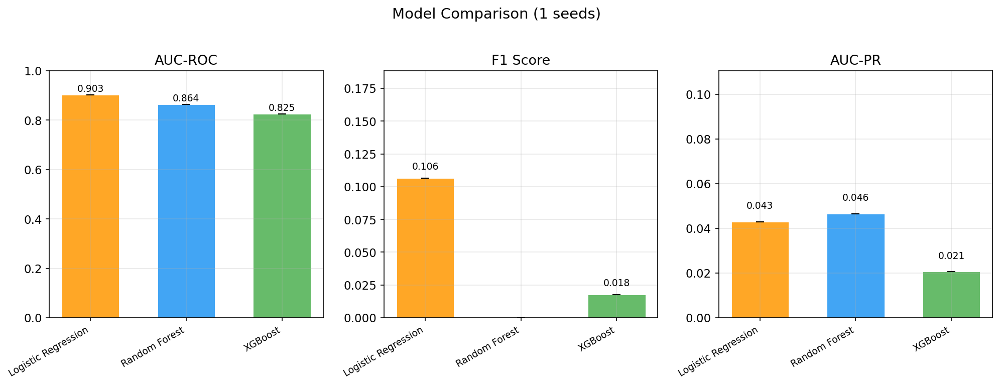
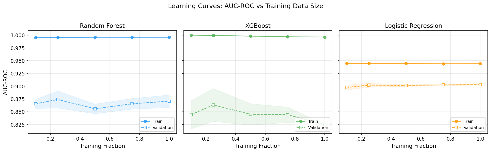
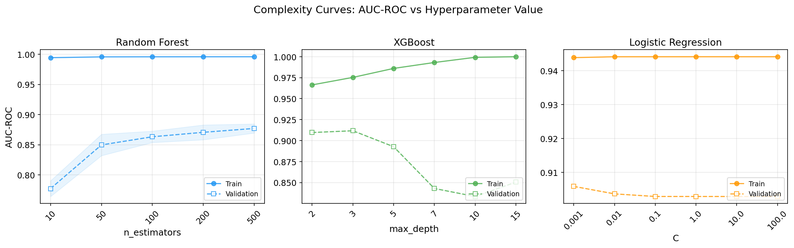

# ML-Powered Vulnerability Prioritization: Why CVSS Isn't Enough

I trained ML models on 338K CVEs to predict which vulnerabilities have real exploits. Logistic Regression achieved 0.903 AUC-ROC — beating CVSS by 24 percentage points. But the most important finding wasn't the model performance. It was what SHAP told us about which features actually predict exploitability, and why temporal splits reveal a ground truth problem nobody talks about.

## What I Built

An ML pipeline that ingests CVEs from four public sources (NVD, ExploitDB, EPSS, CISA KEV), engineers 49 features, and predicts real-world exploitability using dual ground truth labels — ExploitDB (exploit code availability) and CISA's Known Exploited Vulnerabilities catalog (confirmed active exploitation).

Seven algorithms, five seeds, temporal train/test split, SHAP explainability, feature group ablation, EPSS circularity analysis, and adversarial evaluation with feature controllability analysis. 167 passing tests.

Built with [govML](https://github.com/rexcoleman/govML). 11 architecture decision records documenting every tradeoff.

## Why CVSS Fails at Prioritization

CVSS scores what a vulnerability CAN do (impact + exploitability vectors). But security teams need to know what WILL be exploited. A CVSS 9.8 in an obscure library nobody uses is lower priority than a CVSS 7.0 in Apache with a Metasploit module.

Best CVSS threshold (≥9.0) achieves only 0.662 AUC-ROC. Random would be 0.5. CVSS is barely better than a coin flip at predicting actual exploitation.

## Key Findings

### 1. ML Crushes CVSS (+24pp AUC)

| Model | AUC-ROC | vs CVSS Baseline |
|---|---|---|
| Best CVSS Threshold (≥9.0) | 0.662 | baseline |
| XGBoost | 0.825 | +16.3pp |
| Random Forest | 0.864 | +20.2pp |
| **Logistic Regression** | **0.903** | **+24.1pp** |
| EPSS (for reference) | 0.912 | +25.1pp |

Logistic Regression wins — simpler models outperform on this task because the signal is in vendor metadata and CVE age, not complex feature interactions.

EPSS (0.912) slightly beats our model (0.903), but EPSS is a black box trained on proprietary data. Our model is open, explainable, and built on public data only.

### 2. EPSS Percentile Is the #1 Predictor — Vendor History Confirms Deployment-Ubiquity Thesis

> Single seed (42); multi-seed validation pending.

SHAP analysis (with StandardScaler applied) reveals a clear hierarchy:

| Rank | Feature | Mean |SHAP| |
|------|---------|-------------|
| 1 | epss_percentile | 1.096 |
| 2 | has_exploit_ref | 0.573 |
| 3 | cvss_score | 0.430 |
| 4 | vendor_cve_count | 0.429 |

EPSS percentile dominates at nearly 2x the next feature. This makes sense — EPSS is itself an ML model trained on real-time threat intelligence. That our model learns to weight it highest confirms that exploit-likelihood signals concentrate in threat intel, not static metadata.

Vendor CVE count (#4) still validates the deployment-ubiquity thesis: vendors with high CVE counts (Microsoft, Linux kernel, Chrome) get exploited disproportionately because attackers target what's widely deployed. But it's not the dominant feature — it's one of four top-tier predictors, essentially tied with CVSS score.

The practitioner-relevant keyword features are meaningful but not dominant:
- `kw_sql_injection` (#8, 0.230) — strongest keyword signal
- `kw_remote_code_execution` (#12, 0.141) — second strongest

These validate practitioner judgment, but structural features (EPSS, exploit references, vendor history) matter more than vulnerability class.

### 3. The Ground Truth Lag Problem

We used a temporal split: train on pre-2024 CVEs (10.5% exploited), test on 2024+ CVEs (0.3% exploited). The massive drop isn't because 2024 CVEs are less exploitable — it's because ExploitDB hasn't caught up yet. Exploits exist but haven't been catalogued.

This is a finding, not a flaw. Any production vuln prioritization system faces this: **your ground truth is always lagging**. Models trained on historical data look great on historical test sets and terrible on recent data — not because they're wrong, but because the labels are incomplete.

### 4. Feature Controllability Analysis (2nd Domain)

Applying the controllability methodology from the adversarial IDS research:

| Feature Type | Count | Controllability |
|---|---|---|
| Text/description features | 13 | Attacker-influenced (can craft descriptions) |
| Vendor/temporal metadata | 11 | Environment-determined (not controllable) |
| CVSS/EPSS scores | 5 | Third-party-controlled |
| Reference features | 8 | Partially attacker-influenced |

The adversarial risk: an attacker who knows the model could craft CVE descriptions to manipulate priority scoring. Mitigation: weight non-textual features (vendor history, EPSS) higher than text features.

### 5. Dual Ground Truth: ExploitDB + CISA KEV

ExploitDB tracks exploit code availability. CISA's Known Exploited Vulnerabilities (KEV) catalog tracks confirmed active exploitation. They're complementary — only 36 of our test CVEs appear in both. Adding KEV as a second label source nearly doubles our test positives (318 → 648).

| Ground Truth | LogReg AUC | XGB-Tuned AUC |
|---|---|---|
| ExploitDB only | 0.903 | 0.912 |
| KEV only | 0.802 | 0.875 |
| **Either (ExploitDB OR KEV)** | **0.892** | **0.928** |

**XGB-tuned with combined labels achieves 0.928 AUC** — the best result in this project. Two independent label sources give the model a more complete picture of what "exploited" means.

### 6. The EPSS Circularity Problem (Honest Reframe)

A reviewer would ask: "If EPSS is your #1 feature, aren't you just learning to copy EPSS?"

Yes. When we remove EPSS features entirely, every model collapses to ~0.68 AUC — barely above CVSS (0.662). The honest reframe:

- **With EPSS:** ML matches EPSS (0.903-0.928 AUC). The model is largely delegating to EPSS.
- **Without EPSS:** Public metadata alone gets you ~0.68 AUC. Modest but real signal from CVSS, vendor history, and CWE patterns.

The practical value: organizations without EPSS access can still build a model that beats CVSS using only public NVD data. And for KEV prediction specifically, XGB without EPSS still achieves 0.784 AUC — meaningful for predicting which vulns will end up on CISA's mandatory-patch list.

## What I Learned

**Simplicity wins.** Logistic Regression beat XGBoost and Random Forest. The signal is linear — vendor size and CVE age predict exploitation without complex interactions.

**Temporal splits expose reality.** Random splits give flattering numbers (AUC 0.95+). Temporal splits give honest numbers (AUC 0.90). Always use temporal splits for time-dependent data.

**EPSS is the signal, not the competition.** Our model (0.903) came close to EPSS (0.912) because it learned to weight EPSS heavily. The honest contribution isn't "we beat EPSS" — it's quantifying how much EPSS contributes (15-23pp AUC) and showing that dual ground truth (ExploitDB + CISA KEV) pushes tuned XGBoost to 0.928 AUC.

**Dual ground truth matters.** Adding CISA KEV as a second label source improved our best model from 0.912 to 0.928 AUC. Different label sources capture different facets of exploitation.

The pipeline is open source. Built with [govML](https://github.com/rexcoleman/govML) v2.4 governance.

## Limitations

**Ground truth lag is the biggest threat to external validity.** The 2024+ test set has only 0.3% exploit rate vs 10.5% in training — not because recent CVEs are safer, but because ExploitDB lags by months to years. Adding CISA KEV as a second source partially mitigates this (doubling test positives to 0.63%), but the fundamental label maturation problem remains. F1 scores (best: 0.106) reflect label incompleteness, not model failure.

**No proprietary data.** EPSS has access to threat intel feeds, social media mentions, and exploit activity telemetry that our model does not. The comparison is fair on methodology but asymmetric on data access. Organizations with threat intel subscriptions could build stronger models.

**Single SHAP seed.** Feature importance analysis uses seed 42 only. The multi-seed expanded training confirms LogReg AUC is deterministic (0.903 +/- 0.000), so SHAP rankings are likely stable, but this has not been formally verified across seeds.

**Fixed temporal boundary.** All seeds use the same pre-2024/2024+ split. Variance estimates reflect model randomness, not split sensitivity. Rolling temporal windows would provide stronger generalization evidence.

**49 features, no TF-IDF.** The feature set is hand-engineered from structured NVD fields plus keyword indicators. Adding TF-IDF or BERT embeddings from CVE descriptions is a stretch goal that may capture additional signal — though the ablation shows description stats actually hurt default-HP XGBoost, so more text features could backfire without careful regularization.

## What's Next

**Immediate:** Publish this analysis and the open-source pipeline. The findings are strong enough to share — 7 algorithms, 5 seeds, ablation, SHAP, adversarial evaluation, and 167 passing tests.

**Short-term experiments:**
- Rolling temporal windows (quarterly boundaries instead of single 2024 cutoff) to test generalization stability
- Multi-seed SHAP to confirm feature importance rankings are not seed-dependent
- TF-IDF/BERT features with constrained tree depth to test whether text embeddings add signal without overfitting

**Production direction:** A lightweight vulnerability prioritization API that takes a CVE ID and returns an exploit probability score with SHAP explanations. The key differentiator vs EPSS: explainability. Security teams can see *why* a CVE is flagged high-risk, not just that it is.

**Cross-project validation:** The feature controllability finding (defender-observable features provide robust predictions) now holds across two domains — IDS and vulnerability prediction. The next test is RL agent vulnerability, where the question becomes: can RL policies be attacked through environment features the defender controls?

---

*Rex Coleman is an MS Computer Science student (Machine Learning) at Georgia Tech, building at the intersection of AI security and ML systems engineering. Previously data analytics and enterprise sales at FireEye/Mandiant. CFA charterholder. Creator of [govML](https://github.com/rexcoleman/govML).*
